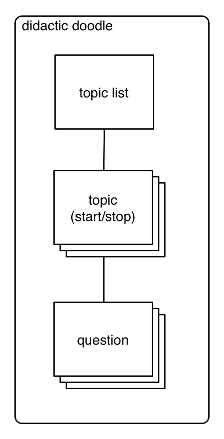

# React Redux Intermediate Class #2

This is an intermediate-level tutorial (tied in with a [Codementor.io course](https://www.codementor.io/classes)) that presumes that readers are proficient with JavaScript, have at least a passing familiarity with JavaScript 2015 syntax, and have done some basic work with React.js.

Let's build a flash card app to begin. It seems to fit with our GitHub-inspired app name, *Didactic Doodle*.

## Instructions

1. We need a back end API for our app. To save time during initial development, we'll use the wonderful [json-server](https://github.com/typicode/json-server). Let's begin by installing it:

  ```sh
  npm i -S json-server
  ```

2. Next, we'll need to add a basic DB. For `json-server`, this is just a file with a JSON object. Each key is a different collection. So in our root folder, we'll need a `db.json` file (you can name it whatever you like). We'll preload it with some test data:

  ```json
  // db.json
  {
    "topics": [
      {
        "id": 1,
        "title": "Literary Devices"
      }
    ],
    "cards": [
      {
        "id": 1,
        "topicId": 1,
        "word": "Accumulation",
        "definition": "Accumulation is derived from a Latin word which means 'pile up'. It is a stylistic device that is defined as a list of words which embody similar abstract or physical qualities or meanings with the intention to emphasize the common qualities that words hold. It is also an act of accumulating the scattered points. Accumulation examples are found in literary pieces and in daily conversations.",
        "example": "Then shall our names,<br>Familiar in his mouth as household words,<br>Harry the King, Bedford and Exeter,<br>Warwick and Talbot, Salisbury and Gloucester,<br>Be in their flowing cups freshly remembered",
        "misses": 0,
        "hits": 0
      },
      {
        "id": 2,
        "topicId": 1,
        "word": "Ballad",
        "definition": "The word Ballad is of French provenance. It is a type of poetry or verse which was basically used in dance songs in the ancient France. Later on, during the late 16th and 17th century, it spread over the majority of European nations. Owing to its popularity and emotional appeal, it remained a powerful tool for poets and lyricists to prepare music in the form of lyrical ballads and earn a handsome income from it.",
        "example": "'Day after day, day after day<br>We stuck nor breathe, nor motion;<br>As idle as a painted ship<br>Upon a painted ocean'",
        "misses": 0,
        "hits": 0
      },
      {
        "id": 3,
        "topicId": 1,
        "word": "Cacophony",
        "definition": "If we speak literally, cacophony points to a situation where there is a mixture of harsh and inharmonious sounds. In literature, however, the term refers to the use of words with sharp, harsh, hissing and unmelodious sounds primarily those of consonants to achieve desired results.",
        "example": "I detest war because cause of war is always trivial.",
        "misses": 0,
        "hits": 0
      },
      {
        "id": 4,
        "topicId": 1,
        "word": "Dactyl",
        "definition": "Dactyl is a metrical foot, or a beat in a line, containing three syllables in which first one is accented followed by second and third unaccented syllables (accented/unaccented/unaccented) in quantitative meter such as in the word 'humanly.' In dactyl, we put stress on first syllable and do not stress on second and third syllables, try to say it loud-'HU-man-ly.' Dactyl originates from a Greek word dáktylos, which means finger, because it is like bones of human fingers, beginning from central long knuckle, which is followed by two short bones.",
        "example": "<b>Half</b> a league, <b>half</b> a league,<br><b>Half</b> a league <b>on</b>ward,<br><b>All</b> in the <b>val</b>ley of <b>Death</b> <br><b>Rode</b> the six <b>hun</b>dred.<br>'<b>For</b>ward, the <b>Light</b> Brigade!<br><b>Charge</b> for the <b>guns</b>!' he said.<br><b>In</b>to the <b>val</b>ley of <b>Death</b><br><b>Rode</b> the six <b>hun</b>dred.",
        "misses": 0,
        "hits": 0
      },
      {
        "id": 5,
        "topicId": 1,
        "word": "Elegy",
        "definition": "Elegy is a form of literature which can be defined as a poem or song in the form of elegiac couplets, written in honor of someone deceased. It typically laments or mourns the death of the individual.",
        "example": "My Captain does not answer, his lips are pale and still;<br>My father does not feel my arm, he has no pulse nor will;<br>The ship is anchor’d safe and sound, its voyage closed and done;<br>From fearful trip, the victor ship, comes in with object won;<br>Exult, O shores, and ring, O bells!<br>But I, with mournful tread,<br>Walk the deck my Captain lies,<br>Fallen cold and dead.",
        "misses": 0,
        "hits": 0
      },
      {
        "id": 6,
        "topicId": 1,
        "word": "Fable",
        "definition": "The word fable is derived from a Latin word 'fibula' which means a story that is a derivative of a word 'fari' which means to speak. Fable is a literary device which can be defined as a concise and brief story intended to provide a moral lesson at the end.",
        "example": "Now, comrades, what is the nature of this life of ours? Let us face it: our lives are miserable, laborious, and short. We are born, we are given just so much food as will keep the breath in our bodies… and the very instant that our usefulness has come to an end…. No animal in England knows the meaning of happiness or leisure after he is a year old. No animal in England is free. The life of an animal is misery and slavery….",
        "misses": 0,
        "hits": 0
      },
      {
        "id": 7,
        "topicId": 1,
        "word": "Genre",
        "definition": "Genre means the type of art, literature or music characterized by a specific form, content and style. For example, literature has four main genres; poetry, drama, fiction and non-fiction. All of these genres have particular features and functions that distinguish them from one another. Hence, it is necessary on the part of readers to know which category of genre they are reading in order to understand the message it conveys, as they may have certain expectations prior to the reading concerned.",
        "example": "",
        "misses": 0,
        "hits": 0
      },
      {
        "id": 8,
        "topicId": 1,
        "word": "Haiku",
        "definition": "A haiku poem has three lines, where the first and last lines have five moras, while the middle line has seven. The pattern in Japanese genre is 5-7-5. The mora is another name of a sound unit, which is like a syllable, but it is different from a syllable. As the moras cannot be translated into English, they are modified and syllables are used instead. The lines of such poems rarely rhyme with each other.",
        "example": "Autumn moonlight-<br>a worm digs silently<br>into the chestnut.",
        "misses": 0,
        "hits": 0
      },
      {
        "id": 9,
        "topicId": 1,
        "word": "Iamb",
        "definition": "An iamb is a literary device that can be defined as a foot containing unaccented and short syllables followed by a long and accented syllable in a single line of a poem (unstressed/stressed syllables). Two of Robert Frost's poems <i>Dust of Snow</i> and <i>The Road not Taken</i> are considered two of the most popular examples of iamb.",
        "example": "Has <b>giv</b>en my <b>heart</b><br>A <b>change</b> of <b>mood</b><br>And <b>saved</b> some <b>part</b><br>Of a <b>day</b> I had <b>rued</b>.",
        "misses": 0,
        "hits": 0
      },
      {
        "id": 10,
        "topicId": 1,
        "word": "Jargon",
        "definition": "Jargon is a literary term that is defined as a use of specific phrases and words by writers in a particular situation, profession or trade. These specialized terms are used to convey hidden meanings accepted and understood in that field. Jargon examples are found in literary and non-literary pieces of writing.",
        "example": "Certain medications can cause or worsen nasal symptoms (especially congestion). These include the following: birth control pills, some drugs for high blood pressure (e.g., alpha blockers and beta blockers), antidepressants, medications for erectile dysfunction, and some medications for prostatic enlargement. If rhinitis symptoms are bothersome and one of these medications is used, ask the prescriber if the medication could be aggravating the condition.",
        "misses": 0,
        "hits": 0
      }
    ]
  }
  ```

  We have a `topics` collection with one topic so far, and an associated `cards` collection. Each card represents a flash card. It has a **word** to display on one side of the card, and both a **definition** and an **example** to display on the flip side.

3. By default, `json-server` will only nest routes one level deep. We want to go two: down to the individual card, e.g., `/topics/1/cards/3`. We can do this by adding a `routes.json` file and specifying an alias to a filtered route, thus:

  ```json
  // routes.json
  {
    "/topics/:topicId/cards/:cardId": "/cards/:cardId?topicId=:topicId"
  }
  ```

4. Now we can add a script to our `/package.json` file to start the JSON API server using the `db.json` and `routes.json` files:

  ```json
  "server": "json-server --watch db.json --routes routes.json --port 3005",
  ```

  When we run this with `npm run server`, we should be able to access the JSON API at, for example, [http://localhost:3005/topics/1/cards/3](http://localhost:3005/topics/1/cards/3). Play around with it. Pretty neat, huh? And with a REST tool such as Postman or Paws, you can do POST, PUT, DELETE, etc. requests as well.

5. We'll need a library with which to do AJAX&mdash;OK, AJAJ (Asynchronous JavaScript and **JSON**)&mdash;too. jQuery is too heavy. We don't need all that stuff. [Superagent](https://github.com/visionmedia/superagent) is very nice. But [Axios](https://github.com/mzabriskie/axios) makes better use of JS promises, so let's use that:

  ```sh
  npm i -S axios
  ```

  And let's drop some code into our `/app/components/app.jsx` file temporarily to see if things work. Add the following somewhere in `app.jsx`:

  ```jsx
  import axios from 'axios'

  axios.get('http://localhost:3005/topics/1/cards/4')
    .then((resp) => console.log(resp))
    .catch((err) => console.log(err))
  ```

  Then start the JSON API server (`npm run server`) in one terminal tab or window or pane, and the HMR WebpackDevServer (`npm start`) in another. Load the app at [http://localhost:8080/](http://localhost:8080/) and check the Dev Tools console. You should see a successful API call that returns the JSON for the Card with ID 4.

  Once you have tested it, move the above JS into a temp file&mdash;we'll need it later.

6. What we have in mind is a very simple app to show flash cards arranged by topic. We'll also track views and how many times the user got the card right (on the honor system&mdash;what's the point of cheating?). And we'll come up eventually with a clever algorithm for deciding which cards to show, when, and how often.

  Here is a basic IA diagram of our app as we currently intend to build it (we'll complicate it later, as is our wont):

  

  First thing we'll need to do is to rename our pages. We can leave the Home page alone for now, but let's change `/app/components/about.jsx` to `/app/components/topic.jsx` and add a new file (we can just copy the code across for now and change the names) in `/app/components/card.jsx`:

  ```jsx
  // app/components/topic.jsx (formerly about.jsx)
  import React from 'react'

  import { Col, Row } from 'react-bootstrap'

  const Topic = () => <Row>
    <Col xs={12}>
      <h1>Topic</h1>
    </Col>
  </Row>

  export default Topic
  ```


  ```jsx
  // app/components/card.jsx
  import React from 'react'

  import { Col, Row } from 'react-bootstrap'

  const Card = () => <Row>
    <Col xs={12}>
      <h1>Card</h1>
    </Col>
  </Row>

  export default Card
  ```

  We'll also need to change the import in `/app/index.jsx` to Topic, and the routes as well:

  ```jsx
  // in app/index.jsx
  import Topic from './components/topic.jsx'
  ```

  ```jsx
  // in app/index.jsx
  <Route path='topic' component={Topic}/>
  ```

  And the link in Header (we'll worry about adding the Card route later):

  ```jsx
  // in app/components/header.jsx
  <LinkContainer to={{ pathname: '/topic' }}>
    <NavItem eventKey={2} href='#'>Topic</NavItem>
  </LinkContainer>
  ```

7. Before we move on to creating our app, let's finish setting up our actions and test our current reducer. Then we'll build on that. We'll begin by creating a button on the Topic page that will increment our counter. We can use a Bootstrap button and update the `/app/components/topic.jsx` file like so:

  ```js
  // in app/components/topic.jsx
  import { Button, Col, Row } from 'react-bootstrap'

  const Topic = () => <Row>
    <Col xs={12}>
      <h1>Topic</h1>
      <Button>+</Button>
    </Col>
  </Row>
  ```

8. Next, we'll want a click of the button to dispatch an `INCREMENT` action to our Redux store. We're going to use the [Flux Standard Action](https://github.com/acdlite/flux-standard-action) (FSA) pattern. To do this, we'll use [redux-actions](https://github.com/acdlite/redux-actions), so let's begin by installing that module:

  ```sh
  npm i -S redux-actions
  ```

9. At this point, we need to stop to consider how we want to structure the file system for our app. There are two common approaches. One is to group files by function: components, reducers, actions, etc. The other approach is to group by modules, so all the files associated with, say, the Topic module would go in one folder called `topic`. This includes actions, components, etc.

  The former setup is probably best for small- or medium-sized apps; the latter for large apps. As our app is fairly small, we'll go with a version of the former.

  In our app folder let's create several new folders on the same level as the components folder, and we'll move files accordingly, and we'll add some `index.js` files to allow us to simplify imports. But first, to be consistent with the way others are doing this style, we'll rename our `app` folder to `src` (for "source").

  ```sh
  mv app src
  mkdir src/components/header
  mkdir src/components/home
  touch src/components/index.js
  mkdir src/containers
  mkdir src/containers/app
  mkdir src/containers/card
  mkdir src/containers/topic
  touch src/containers/index.js
  mkdir src/helpers
  touch src/helpers/index.js
  mkdir src/redux
  mkdir src/redux/middleware
  mkdir src/redux/modules
  mkdir src/theme
  mkdir src/utils
  touch src/utils/index.js
  ```

  Next we'll rename and move a few files. As much as I like using the `.jsx` extension to indicate React components, we'll switch to plain `.js` to simplify imports.

  ```sh
  mv src/index.jsx src/client.js
  mv src/reducer.js src/redux/modules/reducer.js
  mv src/main.css src/theme/main.css
  mv src/components/app.jsx src/containers/app/app.js
  mv src/components/card.jsx src/containers/card/card.js
  mv src/components/header.jsx src/components/header/header.js
  mv src/components/home.jsx src/components/home/home.js
  mv src/components/topic.jsx src/containers/topic/topic.js
  ```

10. Next we'll need to fix our imports that are broken. Let's update our `index.js` files to make importing components, etc. a little easier. In `/src/components/index.js` put:

  ```js
  export { default as Header } from './header/header'
  export { default as Home } from './home/home'
  ```

  In `/src/containers/index.js` put:

  ```js
  export { default as App } from './app/app'
  export { default as Card } from './card/card'
  export { default as Topic } from './topic/topic'
  ```

  In `/src/containers/app/app.js` change `import Header from './header.jsx'` to:

  ```js
  import { Header } from '../../components'
  ```

  See how this is going to work? The `index.js` file becomes a kind of shortcut to the individual components. Now in `/src/client.js` change this:

  ```js
  // THIS IS THE OLD VERSION
  import './main.css'

  import App from './components/app.jsx'
  import Home from './components/home.jsx'
  import About from './components/about.jsx'

  import reducer from './reducer.js'
  ```

  to this:

  ```js
  import './theme/main.css'

  import { Home } from './components'
  import { App, Topic } from './containers'

  import reducer from './redux/modules/reducer'
  ```

  And in our `test/tests.js` file, change this:

  ```js
  THIS IS THE OLD VERSION
  import App from '../app/components/app.jsx'
  import Header from '../app/components/header.jsx'

  import reducer from '../app/reducer.js'
  ```

  to this:

  ```js
  import { App } from '../src/containers'
  import { Header } from '../src/components'

  import reducer from '../src/redux/modules/reducer'
  ```

  It's a bit nicer, isn't it? We'll clean this up still more later.

11. We also need to fix our `webpack.config.babel.js` file. Change this:

  ```js
  // THIS IS THE OLD VERSION
  entry: {
    app: PATHS.app
  },
  ```

  to this:

  ```js
  entry: {
    main: './app/client.js'
  },
  ```

  Also, we need to update our PATHS. Change `app` to `src` everywhere except as the name of the build bundle. To make it clear, here's the entire updated `webpack.config.babel.js` file:

  ```js
  import webpack from 'webpack'
  import path from 'path'
  import merge from 'webpack-merge'
  import stylelint from 'stylelint'

  const TARGET = process.env.npm_lifecycle_event

  process.env.BABEL_ENV = TARGET

  const PATHS = {
    src: path.join(__dirname, 'src'),
    build: path.join(__dirname, 'build')
  }

  const common = {
    entry: {
      main: './src/client.js'
    },
    resolve: {
      extensions: [ '', '.js', '.jsx' ]
    },
    output: {
      path: PATHS.build,
      filename: 'app.js'
    },
    externals: {
      'jsdom': 'window',
      'react/lib/ReactContext': 'window',
      'react/lib/ExecutionEnvironment': true,
      'react/addons': true
    },
    module: {
      preLoaders: [
        {
          test: /\.css$/,
          loaders: [ 'postcss' ],
          include: PATHS.src
        },
        {
          test: /\.jsx?$/,
          loaders: [ 'eslint' ],
          include: PATHS.src
        }
      ],
      loaders: [
        {
          test: /\.css$/,
          loaders: [ 'style', 'css', 'myth' ],
          include: PATHS.src
        },
        {
          test: /\.jsx?$/,
          loaders: [ 'babel?cacheDirectory' ],
          include: PATHS.src
        }
      ]
    },
    postcss: function () {
      return [stylelint({
        rules: {
          'color-hex-case': 'lower'
        }
      })]
    }
  }

  const startConfig = {
    devtool: 'eval-source-map',
    devServer: {
      contentBase: PATHS.build,
      historyApiFallback: true,
      hot: true,
      inline: true,
      progress: true,
      stats: 'errors-only',
      host: process.env.HOST,
      port: process.env.PORT
    },
    plugins: [
      new webpack.HotModuleReplacementPlugin()
    ]
  }

  const buildConfig = {}

  const config = (TARGET === 'start' || !TARGET)
    ? merge(common, startConfig)
    : merge(common, buildConfig)

  export default config
  ```

12. Wow! It's like a whole new app. Until we run it, that is. Then it looks the same as the old app. To test it, run our scripts:

  ```sh
  npm run lint
  npm run build
  npm test
  npm start
  ```

  Then check it out at [http://localhost:8080/](http://localhost:8080/) and make sure everything still works.

13. So let's move on. We want output the current state of the counter below the INCREMENT button on the Topic page. How can we get hold of this state? First, we can add a count line like this to `/src/containers/topic/topic.js`:

  ```jsx
  <Col xs={12}>
    <h1>Topic</h1>
    <Button>+</Button>
    <p>The count is {count}.</p>
  </Col>
  ```

  Of course, that won't work yet because there is no `count`. So how do we get that from the store? Well, one way is to grab it from the context. In `/src/client.js` we put it in the context using the `<Provider />` component. Now we can change our `<Topic />` component to grab that store and get it's state. The simplest way is like this:

  ```jsx
  // src/containers/topic/topic.js
  import React, { PropTypes } from 'react'

  import { Button, Col, Row } from 'react-bootstrap'

  const Topic = ({}, { store }) => {
    const { count } = store.getState().reducer

    return <Row>
      <Col xs={12}>
        <h1>Topic</h1>
        <Button>+</Button>
        <p>The count is {count}.</p>
      </Col>
    </Row>
  }

  Topic.contextTypes = {
    store: PropTypes.object.isRequired
  }

  export default Topic
  ```

14. Now we want to have a click of the button increment the count. We can do this by dispatching an `INCREMENT` action to the store:

  ```jsx
  const Topic = ({}, { store }) => {
    const { count } = store.getState().reducer

    const incrementCount = () => store.dispatch({ type: 'INCREMENT' })

    return <Row>
      <Col xs={12}>
        <h1>Topic</h1>
        <Button onClick={incrementCount}>+</Button>
        <p>The count is {count}.</p>
      </Col>
    </Row>
  }
  ```

  Very nice. So now we can click on the button, and we'll see the count change in the store by viewing the wonderful DockMonitor. But there's a problem: the count changes in the store, but the Topic page is not updated to reflect the new count. This is because the Topic component is not aware that the state of the app has changed. What we'd really like to do is to supply that count to the Topic component as a prop. That way when it changed, the prop would change and the Topic component would re-render. And if we passed the `dispatch` method in as a prop as well, then we could still call it with our action.

  This is what a `container` is: it's a component wrapped in another component that does nothing but pull the store out of the context and use it to pass props to the wrapped component. And `react-redux` provides a method for this called `connect`. It takes two parameters&mdash;a `mapStateToProps` function that takes the state from the store and maps whatever parts we need to the props of the wrapped component, and `mapDispatchToProps` which does the same thing for `dispatch`. The `connect` function returns another function. We pass in the component that we want to wrap, and we get back the container. It's easier than it sounds.

15. If we're just passing the store's `dispatch` through unchanged, then `connect` will do it by default. We need to import `connect`. Then we can create our `mapStateToProps` function which will take the `state` and return an object with the props we want. Here, we just want the `reducer.count` from the state. Then we need to change our Topic component to take the `count` and `dispatcher` props that `connect` will pass in. We add the propTypes we need, then wrap the Topic in our TopicContaner and export the container instead:

  ```js
  // in src/containers/topic/topic.js
  import React, { PropTypes } from 'react'

  import { Button, Col, Row } from 'react-bootstrap'

  import { connect } from 'react-redux'

  const mapStateToProps = (state) => {
    return {
      count: state.reducer.count
    }
  }

  const Topic = ({ count, dispatch }) => {
    const incrementCount = () => dispatch({ type: 'INCREMENT' })

    return <Row>
      <Col xs={12}>
        <h1>Topic</h1>
        <Button onClick={incrementCount}>+</Button>
        <p>The count is {count}.</p>
      </Col>
    </Row>
  }

  Topic.propTypes = {
    count: PropTypes.number.isRequired,
    dispatch: PropTypes.func.isRequired
  }

  const TopicContainer = connect(mapStateToProps)(Topic)

  export default TopicContainer
  ```

16. Now look how easy it is to add the DECREMENT action:

  ```jsx
  const Topic = ({ count, dispatch }) => {
    const incrementCount = () => dispatch({ type: 'INCREMENT' })
    const decrementCount = () => dispatch({ type: 'DECREMENT' })

    return <Row>
      <Col xs={12}>
        <h1>Topic</h1>
        <Button onClick={incrementCount}>+</Button>
        <p>The count is {count}.</p>
        <Button onClick={decrementCount}>-</Button>
      </Col>
    </Row>
  }
  ```

17. Ha, ha. Remember [redux-actions](https://github.com/acdlite/redux-actions)? Yeah, me neither. But we're going to use them now to create our action functions for us. First we'll import the `createAction` function:

  ```js
  // in app/containers/topic/topic.js
  import { createAction } from 'redux-actions'
  ```

  Then we'll change our actions from this:

  ```js
  const incrementCount = () => dispatch({ type: 'INCREMENT' })
  const decrementCount = () => dispatch({ type: 'DECREMENT' })
  ```

  To this:

  ```js
  const increment = createAction('INCREMENT')
  const decrement = createAction('DECREMENT')

  const incrementCount = () => dispatch(increment())
  const decrementCount = () => dispatch(decrement())
  ```

18. Does it still work? It should. This may not seem like much of a savings, and in this simplified case it isn't. But if our actions took a payload&mdash;perhaps an amount to increment/decrement the count by, with the default being 1&mdash;then we could just pass that payload into the action functions, e.g. `increment(10)` to get back an action that looks like this:

  ```js
  {
    type: 'INCREMENT',
    payload: 10
  }
  ```

  Try changing the callbacks to this:

  ```js
  const incrementCount = () => dispatch(increment(10))
  const decrementCount = () => dispatch(decrement(5))
  ```

  Then adjust the `/src/redux/modules/reducer.js` file accordingly:

  ```js
  // in src/redux/modules/reducer.js
  case INCREMENT:
    return {
      ...state,
      count: state.count + (action.payload || 1)
    }
  case DECREMENT:
    return {
      ...state,
      count: state.count - (action.payload || 1)
    }
  ```

  Now when you click the increment button, the count should increase by 10, and when you click the decrement button, it should decrease by 5. And this can work even with very complex payloads.

19. Let's move the action creators to the reducer file. We'll export them together. First, in `/src/client.js` change the import for the reducer to this:

  ```js
  import { reducer } from './redux/modules/reducer'
  ```

  Then move the `increment` and `decrement` functions and the import of `createActions` into the `/src/redux/modules/reducer.js` file, and export those and the reducer:

  ```js
  const INCREMENT = 'INCREMENT'
  const DECREMENT = 'DECREMENT'

  import { createAction } from 'redux-actions'

  const increment = createAction(INCREMENT)
  const decrement = createAction(DECREMENT)

  const reducer = (state = { count: 0 }, action) => {
    switch (action.type) {
      case INCREMENT:
        return {
          ...state,
          count: state.count + (action.payload || 1)
        }
      case DECREMENT:
        return {
          ...state,
          count: state.count - (action.payload || 1)
        }
      default:
        return state
    }
  }

  export {
    increment,
    decrement,
    reducer
  }
  ```

  Finally, add the import to the Topic container file, `/src/containers/topic/topic.js`:

  ```js
  // in src/containers/topic/topic.js
  import { increment, decrement } from '../../redux/modules/reducer'
  ```

  and update the import in the tests at `/test/test.js`:

  ```js
  // in test/tests.js
  import { reducer } from '../src/redux/modules/reducer'
  ```

  Does it still work?

20. OK, before we go any further, let's think about the shape our our app's state. But first, let's move the counter into it's own page so we can play with the Topic page. Copy the `topic.js` file into a new folder called `counter` and rename the file to `counter.js`, then change Topic to Counter:

  ```js
  // src/containers/counter/counter.js
  import React, { PropTypes } from 'react'

  import { Button, Col, Row } from 'react-bootstrap'

  import { connect } from 'react-redux'

  import { increment, decrement } from '../../redux/modules/reducer'

  const mapStateToProps = (state) => {
    return {
      count: state.reducer.count
    }
  }

  const Counter = ({ count, dispatch }) => {
    const incrementCount = () => dispatch(increment(10))
    const decrementCount = () => dispatch(decrement(5))

    return <Row>
      <Col xs={12}>
        <h1>Counter</h1>
        <Button onClick={incrementCount}>+</Button>
        <p>The count is {count}.</p>
        <Button onClick={decrementCount}>-</Button>
      </Col>
    </Row>
  }

  Counter.propTypes = {
    count: PropTypes.number.isRequired,
    dispatch: PropTypes.func.isRequired
  }

  const CounterContainer = connect(mapStateToProps)(Counter)

  export default CounterContainer
  ```

  Then add it to the `/src/containers/index.js` file:

  ```js
  // in /src/containers/index.js
  export { default as Counter } from './counter/counter'
  ```

  To the `src/components/header/header.js` file:

  ```jsx
  // in src/components/header/header.js
  <LinkContainer to={{ pathname: '/counter' }}>
    <NavItem eventKey={3} href='#'>Counter</NavItem>
  </LinkContainer>
  ```

  And update the `src/client.js` file, too:

  ```js
  // in src/client.js
  import { App, Counter, Topic } from './containers'
  ```

  and:

  ```jsx
  // in src/client.js
  <Route path='/' component={App}>
    <IndexRoute component={Home}/>
    <Route path='topic' component={Topic}/>
    <Route path='counter' component={Counter}/>
  </Route>
  ```

  And we'll restore Topic to its former glory:

  ```jsx
  // src/containers/topic/topic.js
  import React from 'react'

  import { Col, Row } from 'react-bootstrap'

  const Topic = () => <Row>
    <Col xs={12}>
      <h1>Topic</h1>
    </Col>
  </Row>

  export default Topic
  ```

  Now let's re-run everything to make sure it works:

  ```sh
  npm run lint
  npm test
  npm run build
  npm start
  ```

21. Alrighty. State. Hmm.

  So we want our app to allow us to run through a deck of "flash cards". For each card we're presented with a word or concept we want to memorize. Then we "flip" the card over and check whether we were right. It's too complicated to check automatically (though we could eventually have the user write her guesses down and then we could see how they improved over time). That might work for simple cards for memorizing, say, vocabulary. But for concepts it's just too difficult to program for such a simple app.

  We also want the app to present the cards to us in some random order, maybe ten or twenty cards in a session. We loop through the cards repeatedly. After we've gotten a card right three times in a row, that card is retired. Now we could just do a shorter group until all cards are retired and that ends the session. Or we could pull in a new card each time we retire one until the entire topic is exhausted. Maybe this is a setting?

  We'll also need to think about users. Is it one big set and each user sets up her own app? Or do we allow different users? If that's the case, we probably want to authenticate the user. Down the road, we could add administrative privileges and add the cards and topics via the interface. Or give the users the ability to add cards for themselves.

  You can see where this could go. Users could develop their own sets of cards and make them public or keep them private. Users could rate each other's public sets. For people who like to memorize stuff&mdash;which, sadly, does not really include me&mdash;this could be a really fun and educational app.

  But for our purposes, let's stick with simple for now. One user, one topic to start, maybe a dozen cards. We'll need to have a "word" for the "front" of the card, and a "definition" for the back. Maybe through in an "example". We need to have an `id` and a `topicId`. Then we'll need to track hits and misses. Here's an example from `db.json`.

  ```json
  {
    "id": 1,
    "topicId": 1,
    "word": "Accumulation",
    "definition": "Accumulation is derived from a Latin word which means 'pile up'. It is a stylistic device that is defined as a list of words which embody similar abstract or physical qualities or meanings with the intention to emphasize the common qualities that words hold. It is also an act of accumulating the scattered points. Accumulation examples are found in literary pieces and in daily conversations.",
    "example": "Then shall our names,<br>Familiar in his mouth as household words,<br>Harry the King, Bedford and Exeter,<br>Warwick and Talbot, Salisbury and Gloucester,<br>Be in their flowing cups freshly remembered",
    "misses": 0,
    "hits": 0
  }
  ```

  Later we'll probably want to move the hits and misses out to a separate collection, probably in the user or associated with the user. Maybe "views"? But I doubt we'll have time to get that far . . .

  To start, let's work locally in the client. Then we'll persist the data and changes to the server, loading the initial data from there as well.

  So let's copy the `db.json` file into an `initialState` constant in our `/src/redux/modules/reducer.js` file:

  ```js
  // in src/redux/modules/reducer.js
  const initialState = {
    topics: [
      {
        id: 1,
        title: 'Literary Devices'
      }
    ],
    cards: [
      {
        id: 1,
        topicId: 1,
        word: 'Accumulation',
        definition: 'Accumulation is derived from a Latin word which means "pile up". It is a stylistic device that is defined as a list of words which embody similar abstract or physical qualities or meanings with the intention to emphasize the common qualities that words hold. It is also an act of accumulating the scattered points. Accumulation examples are found in literary pieces and in daily conversations.',
        example: 'Then shall our names,<br>Familiar in his mouth as household words,<br>Harry the King, Bedford and Exeter,<br>Warwick and Talbot, Salisbury and Gloucester,<br>Be in their flowing cups freshly remembered',
        misses: 0,
        hits: 0
      } // 9 more . . .
    ],
    count: 0
  }

  const reducer = (state = initialState, action) => {
    // reducer code
  }
  ```

  Run the linter, tests, etc. and check it out in the Dock. See how it's in our state? Now we have a starting point. Later we'll pull this in from the server API and we'll persist updates to the back end as well.

22. Now we'll work on using this new state. We want to list all our topics on the home page, so we'll need to convert the Home component to a container. Let's move the folder over first:

  ```sh
  mv src/components/home src/containers/home
  ```

  Then we'll need to fix the imports. Remove `export { default as Home } from './home/home'` from `src/components/index.js` and add it to `src/containers/index.js`:

  ```js
  export { default as App } from './app/app'
  export { default as Card } from './card/card'
  export { default as Counter } from './counter/counter'
  export { default as Home } from './home/home'
  export { default as Topic } from './topic/topic'
  ```

  Then change `/src/clients.js` from this:

  ```js
  // THIS IS THE OLD VERSION
  import { Home } from './components'
  import { App, Card, Counter, Topic } from './containers'
  ```

  to this:

  ```js
  // in src/clients.js
  import { App, Card, Counter, Home, Topic } from './containers'
  ```

23. Now we can convert the Home component to a container that will load the list of topics from the store. First, we'll need to add the `PropTypes` to our import. Then we'll import the Bootstrap `<Table/>` to use for listing our topics. We can grab the code from [react-bootstrap Table](https://react-bootstrap.github.io/components.html#tables) and strip it down for our use. Finally, we'll need `connect` from `react-redux`:

  ```js
  // in src/containers/home/home.js
  import React, { PropTypes } from 'react'

  import { Col, Row, Table } from 'react-bootstrap'

  import { connect } from 'react-redux'
  ```

  We'll map our state to the props, mapping the `topics` array:

  ```js
  // in src/containers/home/home.js
  const mapStateToProps = (state) => {
    return {
      topics: state.reducer.topics
    }
  }
  ```

  Then we'll import the props we need into the Home component, change the heading, and add the table to display the topics. For now, we'll just check the length of the array (should be 1) to make sure we're getting it.

  ```js
  // in src/containers/home/home.js
  const Home = ({ topics, dispatch }) => <Row>
    <Col xs={6}>
      <h1>Topics</h1>

      <Table striped bordered condensed hover>
        <tbody>
          <tr>
            <td>{topics.length}</td>
          </tr>
        </tbody>
      </Table>
    </Col>
  </Row>
  ```

  We need to declare our `propTypes`:

  ```js
  // in src/containers/home/home.js
  Home.propTypes = {
    topics: PropTypes.array.isRequired,
    dispatch: PropTypes.func.isRequired
  }
  ```

  Then we can create our HomeContainer and export it:

  ```js
  // in src/containers/home/home.js
  const HomeContainer = connect(mapStateToProps)(Home)

  export default HomeContainer
  ```

  If we run the app and check the home page, we should see a table with `1` in a single row.

24. Let's create a function to render our table rows. If you've taken one of my classes before, you know that I'm a big fan of [ramda.js](http://ramdajs.com/docs/). Let's install that to get the benefits. If you haven't used it, it's like lodash or underscore on steriods.

  We'll import Ramda's `addIndex` and `map` functions, and we'll use the `addIndex` function to create our own `map` function that passes the index as well as the value:

  ```js
  // in src/containers/home/home.js
  import { addIndex, map } from 'ramda'

  const indexedMap = addIndex(map)
  ```

  Then we can create a render function that will run through the topics and return a row for each. Add the function, using the index as the `key` property for the row, and then update the component to use `renderRows`:

  ```js
  // in src/containers/home/home.js
  const renderRows = (topics) => indexedMap((topic, idx) => <tr key={idx}>
    <td>{topic.title}</td>
  </tr>, topics)

  const Home = ({ topics, dispatch }) => <Row>
    <Col xs={6}>
      <h1>Topics</h1>

      <Table striped bordered condensed hover>
        <tbody>{renderRows(topics)}</tbody>
      </Table>
    </Col>
  </Row>
  ```

  That should work, but just to test it, let's update our `initialState` in our `/src/redux/modules/reducer.js` file to include a second topic:

  ```js
  // in src/redux/modules/reducer.js
  topics: [
    {
      id: 1,
      title: 'Literary Devices'
    },
    {
      id: 2,
      title: 'Famous Dogs'
    }
  ],
  ```

  Now we should see both topics.

25. Let's make them links to the topic pages in question. We'll need to update the routes to handle the `topicId`. In the `/src/client.js` file. We'll nest the Card path and require a cardId as well, but we may need to change this.

  ```jsx
  // in src/client.js
  <Router history={history}>
    <Route path='/' component={App}>
      <IndexRoute component={Home}/>
      <Route path='topic/:topicId' component={Topic}>
        <Route path='card/:cardId' component={Card}/>
      </Route>
      <Route path='counter' component={Counter}/>
    </Route>
  </Router>
  ```

  We're going to go to the topics from the Home page, so let's remove the link in the Header, too and change the `eventKey` of the Counter:

  ```jsx
  // in src/components/header/header.js
  <Navbar.Collapse>
    <Nav>
      <IndexLinkContainer to={{ pathname: '/' }}>
        <NavItem eventKey={1} href='#'>Home</NavItem>
      </IndexLinkContainer>
      <LinkContainer to={{ pathname: '/counter' }}>
        <NavItem eventKey={2} href='#'>Counter</NavItem>
      </LinkContainer>
    </Nav>
  </Navbar.Collapse>
  ```

26. Now let's update the Topic component to Display the topic title (for starters). Import the `connect` function and create the `mapStateToProps` function, add the props and `propTypes`, create the container, and export it. This should be getting to be second nature by now:

  ```js
  // in src/containers/topic/topic.js
  import { connect } from 'react-redux'

  const mapPropsToState = (state) => {
    return {
      topics: state.reducer.topics
    }
  }

  const Topic = ({ topics, params, dispatch }) => {
    return <Row>
      <Col xs={12}>
        <h1>Topic</h1>
        <p>This is topic #{params.topicId}.</p>
        <p>{JSON.stringify(topics)}</p>
      </Col>
    </Row>
  }

  Topic.propTypes = {
    topics: PropTypes.array.isRequired,
    params: PropTypes.object.isRequired,
    dispatch: PropTypes.func.isRequired
  }

  const TopicContainer = connect(mapPropsToState)(Topic)

  export default TopicContainer
  ```

  When we load the page, we should see our topics as an array. We'll need to find the right topic using that `params.topicId`. Ramda to the rescue! Let's import the Ramda `find` function. We'll need `propEq`, too ([propEq](http://ramdajs.com/docs/#propEq)):

  ```js
  // in src/containers/topic/topic.js
  import { find, propEq } from 'ramda'
  ```

  We'll create our own finder function, and use it to get the correct topic. This is tricky! Remember that the `params.topicId` is coming from the URL, thus it is a *string*. We need an integer, so we'll need to use `parseInt` to cast it to one:

  ```js
  // in src/containers/topic/topic.js
  const Topic = ({ topics, params, dispatch }) => {
    const finder = find(propEq('id', parseInt(params.topicId, 10)))

    return <Row>
      <Col xs={12}>
        <h1>Topic</h1>
        <p>This is topic #{params.topicId}.</p>
        <p>{JSON.stringify(finder(topics))}</p>
      </Col>
    </Row>
  }
  ```

  Now we should see the topic as a string. We'll want to display the title, so change the `<Col>` to:

  ```js
  // in src/containers/topic/topic.js
    <Col xs={12}>
      <h1>{finder(topics).title}</h1>
    </Col>
  ```

  And we should see the title on the page if we go to [http://localhost:8080/topic/1](http://localhost:8080/topic/1).

27. Let's make the rows in the table on the Home page link to the right Topic pages. We'll need to import the `Link` from `react-router`:

  ```js
  // in src/containers/home/home.js
  import { Link } from 'react-router'
  ```

  Then we can update the table:

  ```js
  // in src/containers/home/home.js
  const renderRows = (topics) => indexedMap((topic, idx) => {
    const path = `/topic/${topic.id}`

    return <tr key={idx}>
      <td><Link to={path}>{topic.title}</Link></td>
    </tr>
  }, topics)
  ```

  Now when we check the Home page we can see that the topics are links to the Topic page.

28. Let's list the cards on the Topic page. We'll import the Table, as with the home page, and do the same thing, but with Cards, each linking to a card page. To begin, we'll update the imports to include the Table, some more Ramda functions, and the Link from `react-router`, and we'll add our `indexedMap` function.

  ```js
  // in src/containers/topic/topic.js
  import { Col, Row, Table } from 'react-bootstrap'

  import { Link } from 'react-router'

  import { addIndex, find, map, propEq } from 'ramda'

  const indexedMap = addIndex(map)
  ```

  Then we'll update our Topic component and the `propTypes`:

  ```js
  // in src/containers/topic/topic.js
  const Topic = ({ cards, topics, params, dispatch }) => {
    const finder = find(propEq('id', parseInt(params.topicId, 10)))

    return <Row>
      <Col xs={12}>
        <h1>{finder(topics).title}</h1>

        <Table striped bordered condensed hover>
          <tbody>{renderRows(cards)}</tbody>
        </Table>
      </Col>
    </Row>
  }

  Topic.propTypes = {
    cards: PropTypes.array.isRequired,
    topics: PropTypes.array.isRequired,
    params: PropTypes.object.isRequired,
    dispatch: PropTypes.func.isRequired
  }
  ```

  Finally, we'll add an updated `renderRows` function that works with cards and nested paths:

  ```js
  // in src/containers/topic/topic.js
  const renderRows = (cards) => indexedMap((card, idx) => {
    const path = `/topic/${card.topicId}/card/${card.id}`

    return <tr key={idx}>
      <td><Link to={path}>{card.word}</Link></td>
    </tr>
  }, cards)
  ```

  Test everything and it should work. On a Topic page you should see a list of words linking to a (future) Card page. There's just one problem: we show all the cards on every topic page. We need a filter. That's next.


